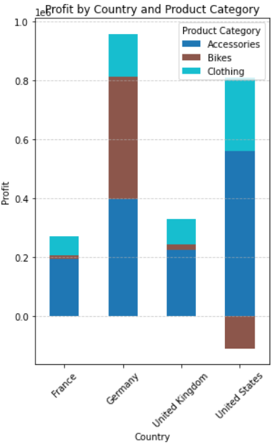

# Data-Analyses-Project

## Executive Summary

Sales analysis of 34.8k records across 2015-2016 shows annual revenue stabilizing at around $11 million, with United state contributing %46 of revenue, %52 of sales and %31 of profit. In terms of country-wise profit, most of the profit is earned from Germany, accounting for 42% of the total profit.
Most profitable product is accessories. Contributing %33 of revenue, %61 of profit and %65 of sales. And 2/3 of accessories profit came from 3 sub product. Helmets, tire and tubes.

## Insights Deep-Dive

### Sales Trends and Growth Rates

In first 7 month of 2016 we already passed last year's revenue by %25. But most importantly starting from 2016 profit skyrocketed from 288k to 1.9m, it is %583 more than last year. This is mostly because of bike sales, which we make a -175k loss last year, started to made 512k profit this year.But in the last month, sales collapsed to pre 2016 level. Sales down by 62%, profit by 70%, and revenue by 79%. Bike sales are collapsed this month to %0 from %26 revenue last month.

