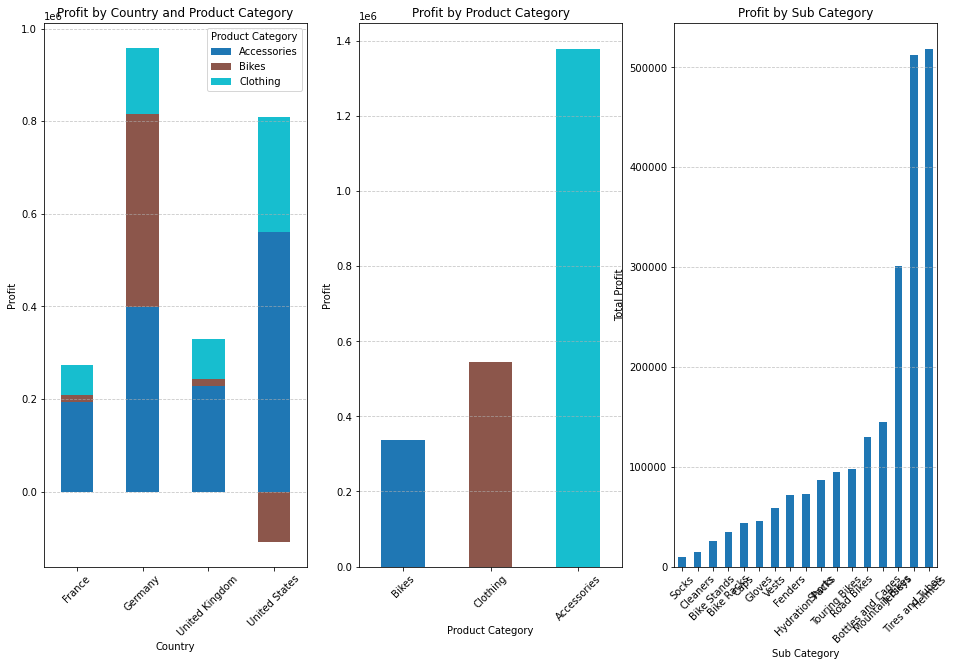

# Bike Retail Sales and Profitability Analysis

Table of Contents

- [About the Dataset](#about-the-dataset)
- [Tableu Dashboard](#tableu-dashboard)
- [Executive Summary](#executive-summary)
    - [Sales Trends and Growth Rates](#sales-trends-and-growth-rates)
    - [Key Product Performance](#key-product-performance)
    - [Country and State Performance](#country-and-state-performance)
    - [Losses-From-2015-and-Customer-Age-in-USA](#Losses-From-2015-and-Customer-Age-in-USA)
- [Recommendations](#Recommendations)

***

## About the Dataset

This dataset provides information on the sales of the company's products across various regions in Europe and America. It includes detailed demographic data on customers, such as age, gender, country, and state. Additionally, it captures details on the quantity of products purchased, unit prices, production costs, product categories and subcategories, as well as the overall cost and revenue generated by the organization

Click the image below for databese source.

## Tableu Dashboard
Click the image below for interactive dashboard.

## Executive Summary

Sales analysis of 34.8k records across 2015-2016 shows annual revenue stabilizing at around $11 million, with United state contributing %46 of revenue, %52 of sales and %31 of profit. In terms of country-wise profit, most of the profit is earned from Germany, account for 42% of the total profit.
Most profitable product is accessories. Contributing %33 of revenue, %61 of profit and %65 of sales. And 2/3 of accessories profit came from 3 sub product. Helmets, tire and tubes.

## Insights Deep-Dive

### Sales Trends and Growth Rates

In first 7 month of 2016 we already passed last year's revenue by %25. But most importantly starting from 2016 profit skyrocketed from 288k to 1.9m, it is %583 more than last year. But in the last month, sales collapsed to pre 2016 level. Sales down by 62%, profit by 70%, and revenue by 79%.

### Key Product Performance
In 2015 Bike sales, made a -175k loss. In the first 6 month of 2016, bikes sales profit skyrocketed to 512k. But suddenly bike sales are collapsed this month to %0 from %26 of the profit last month. There is not even one product that didn't affected by this sudden decline of sales. Even the biggest profit contributor, the sub-category Helmets, saw a 60% decline in sales. However, the second-biggest profit contributor, Tires and Tubes, held up better, with sales declining by only 40%. Still, this is a significant drop.

### Country and State Performance

Germany accounts for 42% of the total profit while contributing only 19% of the revenue. It has the highest profit margin, and sales there are evenly distributed across the states where our stores operate. 
However, in other countries, certain states—such as California, England, and Washington—together account for 59% of the revenue but only 41% of the profit. Outside of Germany, the focus should be on these states.

### Losses From 2015 and Customer Age in USA

Most of the losses happened on 2015 came from USA bike Sales. These loss came from sales to young costumers but particularly from customers whose age is between 24 and 30.

## Recommendations

- Selling bikes at a loss in the USA did not pay off, as it did not lead to increased sales of bike accessories or clothing. Sales in the United States grew at the same rate as in other countries. Therefore, this strategy should not be used again in the United States.
- However, while selling bikes at a loss was ineffective, this does not mean that bike sales had no impact on other bike-related product sales. In fact, after bike sales stopped last month, sales of other bike products collapsed. The reason behind the stopping in bike sales must be identified and resolved as soon as possible.
- Because products can be sold in Germany with a higher profit margin, and sales there are strong, with states generally generating similar income, sales operations in Germany should be expanded across the entire country.

